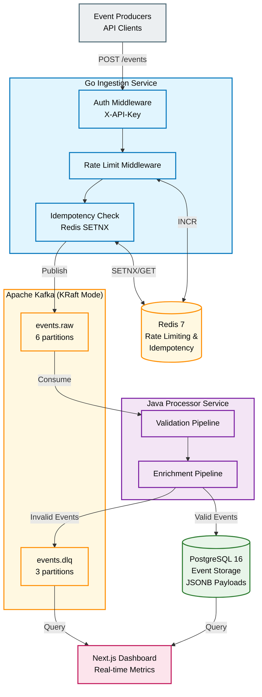

# Pulse Event Platform

A production-grade event ingestion and processing platform designed to handle high-throughput event streams with enterprise features including rate limiting, idempotency guarantees, dead-letter queuing, and real-time observability.

**Built for Internal Teams**: Pulse serves as an internal developer platform that engineering teams within a company can use to capture, process, and analyze event streams from their applications. Teams simply integrate with the HTTP ingestion API using their assigned API keys, and the platform handles the complexity of reliable event processing, storage, and observability—allowing developers to focus on their core product features rather than building data infrastructure.

## Overview

Pulse is a multi-tenant event streaming platform that ingests events via a high-performance HTTP API, processes them through a fault-tolerant pipeline, and provides operational visibility through a real-time admin dashboard. It's designed to be deployed within a company's infrastructure to serve multiple internal teams and applications.

**Key Features:**
- **High-throughput event ingestion** with sub-100ms latency and horizontal scalability
- **API key authentication** for multi-tenant isolation with per-tenant rate limiting
- **Idempotency guarantees** preventing duplicate processing via client-provided idempotency keys
- **Dead-letter queue (DLQ)** for automatic routing of failed events with enriched error context
- **Real-time observability** with event search, Kafka lag monitoring, and DLQ inspection dashboard
- **Load testing utilities** via Python script that simulates multi-tenant traffic, duplicates, and malformed events
- **Containerized infrastructure** using Docker for local development and testing environments

**Set-Up:** To run this yourself, see [resources/info.txt](resources/info.txt)

## Architecture

### System Design

### Data Flow

1. **Ingestion Layer** (Go): Accepts HTTP POST requests with API key authentication, enforces per-tenant rate limits (300 req/min), checks idempotency via Redis, and publishes to Kafka
2. **Streaming Layer** (Kafka): Durable message queue with 6 partitions for parallelism and ordering guarantees
3. **Processing Layer** (Java): Validates schema, enriches metadata, persists to PostgreSQL, routes failures to DLQ
4. **Storage Layer** (PostgreSQL): Indexed event storage with JSONB payloads for flexible querying
5. **Observability Layer** (React): Real-time metrics, event search, DLQ inspection, and Kafka lag monitoring
6. **Infrastructure Layer** (Docker): Orchestrates PostgreSQL, Redis, and Kafka containers (`ep_postgres`, `ep_redis`, `ep_kafka`) with health checks, volume persistence, and network isolation
7. **Load Testing** (Python): Simulates multi-tenant event producers with configurable RPS, duplicate detection testing, malformed event generation, and comprehensive latency reporting

## Technology Stack

| Component | Technology | Purpose |
|-----------|-----------|---------|
| **Ingestion API** | Golang 1.21, Gorilla Mux, Sarama | High-performance HTTP server with minimal memory footprint |
| **Message Broker** | Apache Kafka 4.1 (KRaft) | Distributed event streaming without Zookeeper dependency |
| **Stream Processor** | Java 17, Spring Boot 3, Spring Kafka | Enterprise processing framework with built-in reliability patterns |
| **Cache Layer** | Redis 7 | In-memory store for rate limiting and idempotency tracking |
| **Primary Database** | PostgreSQL 16 | ACID-compliant storage with JSONB support and indexing |
| **Admin Dashboard** | Next.js, React, Tailwind CSS, Recharts | Server-side rendered dashboard with real-time data fetching |
| **Load Testing** | Python | Python script simulates load generation for performance validation |
| **Infrastructure** | Docker | Local orchestration simulating production environments |

## How It Works

### Security & Multi-Tenancy
**API Key Authentication**: Each tenant receives a unique API key for secure access. The Go ingestion service extracts the `X-API-Key` header via middleware and enriches all events with tenant context, ensuring complete isolation between teams.

**Rate Limiting**: Per-tenant sliding window rate limiting (default: 300 req/min) prevents individual teams from overwhelming the system. Implemented using Redis `INCR` commands with TTL-based buckets (`rl:{tenant_id}:{minute_bucket}`). Returns HTTP 429 when limits are exceeded.

### Reliability & Data Integrity
**Idempotency Guarantees**: Clients provide an `Idempotency-Key` header to prevent duplicate processing during retries. The ingestion service uses Redis `SETNX` with a 30-minute TTL (`idem:{tenant_id}:{idempotency_key}`) to ensure at-most-once delivery semantics.

**Dead-Letter Queue**: Events that fail validation (missing required fields, schema errors) are automatically routed to the `events.dlq` Kafka topic with enriched error context. This allows teams to debug issues without losing data, and supports manual reprocessing workflows.

### Observability & Monitoring
The Next.js admin dashboard provides four specialized views for operational visibility:

- **Overview**: Real-time metrics showing events per minute, top event types, total volume, and system health indicators
- **Pipeline**: Kafka consumer lag monitoring, throughput visualization, and processor health status
- **DLQ**: Failed event inspection with expandable JSON payloads, error reasons, and filtering capabilities  
- **Search**: Query interface for debugging specific events by `event_id` or `idempotency_key`

The Java processor exposes REST endpoints for programmatic access to metrics, including time-windowed event counts (5m/30m) and DLQ sampling.

### Development & Testing

**Docker Infrastructure**: The platform uses Docker Compose for local development with three core containers:
- `ep_postgres`: PostgreSQL 16 with JSONB support and persistent volumes
- `ep_redis`: Redis 7 with AOF persistence for rate limiting and idempotency
- `ep_kafka`: Apache Kafka 4.1 in KRaft mode (no Zookeeper required) with manual topic initialization

All containers include health checks to ensure proper startup ordering and simulate production-like environments.

**Load Testing**: The Python-based load generator (`loadgen/loadgen.py`) simulates realistic production scenarios with configurable RPS, multi-tenant traffic distribution, deliberate duplicate injection (to test idempotency), malformed event generation (to test DLQ routing), and comprehensive latency reporting (P50/P95/P99).

## Performance & Scale

### Theoretical Capacity

Based on the current architecture and configuration:

#### **Single-Node Throughput**
- **Go Ingestion Service**: 15,000 - 20,000 requests/second
  - Limited by Kafka producer batching and network I/O
  - P99 latency < 50ms at 10k RPS
- **Kafka Cluster**: 100,000+ messages/second
  - 6 partitions on events.raw allowing parallel consumption
- **Java Processor**: 5,000 - 8,000 events/second per instance
  - Bound by PostgreSQL write throughput and transaction overhead

#### **Horizontal Scaling Potential**

| Component | Scaling Strategy | Theoretical Max (3-node cluster) |
|-----------|-----------------|----------------------------------|
| Go Ingestion | Stateless: Add instances behind load balancer | 60,000 RPS |
| Kafka | Add brokers, increase partitions to 12-24 | 300,000 events/sec |
| Java Processor | Add consumer instances (up to partition count) | 48,000 events/sec (6 instances) |
| PostgreSQL | Read replicas + write sharding by tenant_id | 50,000 writes/sec |
| Redis | Redis Cluster with hash slots | 500,000 ops/sec |

#### **Daily Event Volume Estimates**
- **Configured Rate Limits**: 300 events/min/tenant × 10 tenants = 3,000 events/min = **4.3M events/day**
- **System Capacity**: 10,000 events/sec × 86,400 sec = **864M events/day**
- **With 3-Node Cluster**: 40,000 events/sec sustained = **3.4B events/day**
