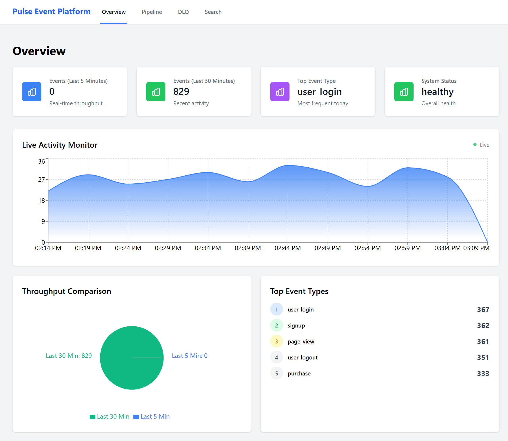

# Pulse Event Platform

A production-grade event ingestion and processing platform designed to handle high-throughput event streams with enterprise features including rate limiting, idempotency guarantees, dead-letter queuing, and real-time observability.



## Overview

Pulse is an internal developer platform for event ingestion and processing that demonstrates the ability to work with modern distributed systems and legacy infrastructure patterns. The platform ingests events via a high-performance HTTP API, processes them through a streaming pipeline, and provides operational visibility through a real-time admin dashboard.

**Key Capabilities:**
- High-throughput event ingestion with sub-100ms latency
- Per-tenant rate limiting and API key authentication
- Idempotency guarantees preventing duplicate processing
- Fault-tolerant processing with automatic dead-letter queue (DLQ) routing
- Real-time observability and event search capabilities
- Horizontal scalability through Kafka partitioning

## Architecture

### System Design

```
┌─────────────────┐
│ Event Producers │
│  (API Clients)  │
└────────┬────────┘
         │
         ▼ POST /events (HTTP/JSON)
┌─────────────────────────────────┐
│   Go Ingestion Service :8080    │
│  ┌───────────┐   ┌────────────┐ │
│  │ Auth      │   │ Rate Limit │ │
│  │ Middleware│   │ Middleware │ │
│  └───────────┘   └────────────┘ │
│  ┌──────────────────────────┐   │
│  │  Idempotency Check       │   │
│  │  (Redis SETNX)           │   │
│  └──────────────────────────┘   │
└────────┬────────────────────────┘
         │
         ▼ Publish
┌─────────────────────────────────┐
│    Apache Kafka (KRaft Mode)    │
│  ┌─────────────────────────┐    │
│  │ events.raw (6 partitions)│   │
│  └─────────────────────────┘    │
└────────┬────────────────────────┘
         │
         ▼ Consume
┌─────────────────────────────────┐
│ Java Processor Service :8081    │
│  ┌───────────┐   ┌────────────┐ │
│  │ Validation│   │ Enrichment │ │
│  │ Pipeline  │   │ Pipeline   │ │
│  └─────┬─────┘   └────────────┘ │
│        │                        │
│    ┌───┴───┐                    │
│    │       │                    │
│  Valid   Invalid                │
└────┬───────┬────────────────────┘
     │       │
     ▼       ▼
┌──────┐  ┌─────────────────────┐
│ PG   │  │ Kafka: events.dlq   │
│ :5432│  │  (3 partitions)     │
└──────┘  └─────────────────────┘
     │              │
     └──────┬───────┘
            ▼
    ┌────────────────┐
    │ React Dashboard│
    │     :3000      │
    └────────────────┘
```

### Data Flow

1. **Ingestion Layer** (Go): Accepts HTTP POST requests with API key authentication, enforces per-tenant rate limits (300 req/min), checks idempotency via Redis, and publishes to Kafka
2. **Streaming Layer** (Kafka): Durable message queue with 6 partitions for parallelism and ordering guarantees
3. **Processing Layer** (Java): Validates schema, enriches metadata, persists to PostgreSQL, routes failures to DLQ
4. **Storage Layer** (PostgreSQL): Indexed event storage with JSONB payloads for flexible querying
5. **Observability Layer** (React): Real-time metrics, event search, DLQ inspection, and Kafka lag monitoring

## Technology Stack

| Component | Technology | Purpose |
|-----------|-----------|---------|
| **Ingestion API** | Golang 1.21, Gorilla Mux, Sarama | High-performance HTTP server with minimal memory footprint |
| **Message Broker** | Apache Kafka 4.1 (KRaft) | Distributed event streaming without Zookeeper dependency |
| **Stream Processor** | Java 17, Spring Boot 3, Spring Kafka | Enterprise processing framework with built-in reliability patterns |
| **Cache Layer** | Redis 7 | In-memory store for rate limiting and idempotency tracking |
| **Primary Database** | PostgreSQL 16 | ACID-compliant storage with JSONB support and indexing |
| **Admin Dashboard** | Next.js, React, Tailwind CSS, Recharts | Server-side rendered dashboard with real-time data fetching |
| **Load Testing** | Python | Concurrent load generation for performance validation |
| **Infrastructure** | Docker | Local orchestration simulating production environments |

## Key Features

### 1. API Key Authentication
Multi-tenant isolation with configurable API keys mapped to tenant IDs. Middleware extracts `X-API-Key` header and enriches events with tenant context.

### 2. Rate Limiting (Redis)
Per-tenant sliding window rate limiting using Redis INCR with TTL. Default: 300 requests/minute per tenant. Returns HTTP 429 when exceeded.

**Redis Key Pattern**: `rl:{tenant_id}:{minute_bucket}`

### 3. Idempotency Guarantees
Client-provided `Idempotency-Key` header prevents duplicate processing. Redis SETNX with 30-minute TTL ensures at-most-once delivery.

**Redis Key Pattern**: `idem:{tenant_id}:{idempotency_key}`

### 4. Dead-Letter Queue (DLQ)
Failed events (schema validation errors, missing fields) are automatically routed to `events.dlq` topic with enriched error context for manual review.

### 5. Event Search & Observability
Admin API provides:
- Search by `event_id` or `idempotency_key`
- Top event types by volume
- Events per minute (last 1m, 5m, 1h)
- Kafka consumer lag monitoring
- DLQ sample inspection

### 6. Real-Time Dashboard
Next.js dashboard with four views:
- **Overview**: Live metrics, event volume trends, system health
- **Pipeline**: Kafka lag, throughput charts, processor status
- **DLQ**: Failed events with expandable payloads and error reasons
- **Search**: Query interface for event debugging

## Performance & Scale

### Theoretical Capacity

Based on the current architecture and configuration:

#### **Single-Node Throughput**
- **Go Ingestion Service**: 15,000 - 20,000 requests/second
  - Limited by Kafka producer batching and network I/O
  - P99 latency < 50ms at 10k RPS
- **Kafka Cluster**: 100,000+ messages/second
  - 6 partitions on events.raw allowing parallel consumption
- **Java Processor**: 5,000 - 8,000 events/second per instance
  - Bound by PostgreSQL write throughput and transaction overhead

#### **Horizontal Scaling Potential**

| Component | Scaling Strategy | Theoretical Max (3-node cluster) |
|-----------|-----------------|----------------------------------|
| Go Ingestion | Stateless: Add instances behind load balancer | 60,000 RPS |
| Kafka | Add brokers, increase partitions to 12-24 | 300,000 events/sec |
| Java Processor | Add consumer instances (up to partition count) | 48,000 events/sec (6 instances) |
| PostgreSQL | Read replicas + write sharding by tenant_id | 50,000 writes/sec |
| Redis | Redis Cluster with hash slots | 500,000 ops/sec |

#### **Daily Event Volume Estimates**
- **Configured Rate Limits**: 300 events/min/tenant × 10 tenants = 3,000 events/min = **4.3M events/day**
- **System Capacity**: 10,000 events/sec × 86,400 sec = **864M events/day**
- **With 3-Node Cluster**: 40,000 events/sec sustained = **3.4B events/day**

#### **Storage Requirements**
- Average event size: 2 KB (JSON payload + metadata)
- 1M events/day = 2 GB/day = 60 GB/month
- 100M events/day = 200 GB/day = 6 TB/month
- PostgreSQL partitioning by date recommended beyond 100M events/day
