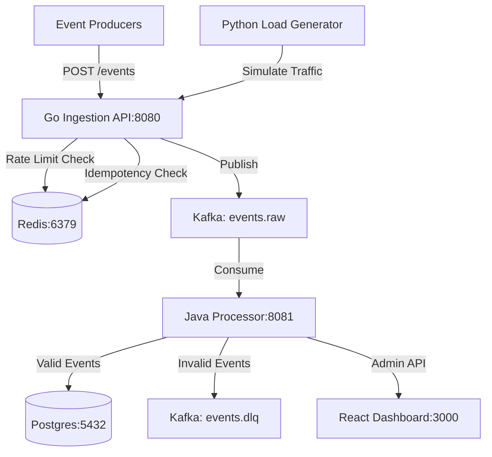

# Build Internal Developer Event Platform

## Architecture Overview



## Implementation Steps

### Step 1: Infrastructure Setup (Docker Compose)

**Create Docker environment with Kafka, Redis, and Postgres**Files to create:

- [`infra/docker-compose.yml`](infra/docker-compose.yml) - Services for Postgres, Redis, and Kafka (KRaft mode)
- [`infra/kafka-init/create-topics.sh`](infra/kafka-init/create-topics.sh) - Creates `events.raw` (6 partitions) and `events.dlq` (3 partitions)
- [`infra/.env`](infra/.env) (optional) - Environment variables

Key configurations:

- Postgres: `ep_postgres_data` volume, healthcheck with `pg_isready`
- Redis: append-only persistence, `ep_redis_data` volume
- Kafka: KRaft mode (no Zookeeper), auto-create disabled, explicit topic creation via init script

**Verification**: Run `docker compose up -d` from `infra/`, verify all containers healthy, topics exist---

### Step 2: Go Ingestion Service (Minimal Version)

**Build fast HTTP API that accepts events and publishes to Kafka**Directory structure:

```javascript
ingest-go/
├── cmd/ingest/main.go
├── internal/
│   ├── config/config.go
│   ├── http/
│   │   ├── router.go
│   │   ├── middleware_auth.go
│   │   ├── handler_events.go
│   │   ├── models.go
│   │   └── responses.go
│   └── kafka/producer.go
└── go.mod
```

Core functionality:

- **POST /events**: Parse JSON, wrap with metadata (tenant_id, received_at, request_id, idempotency_key), publish to `events.raw`
- **GET /health**: Basic health check
- Authentication middleware: Extract `X-API-Key` header, map to tenant_id (e.g., `tenant_a:key_a`)
- Kafka producer: Use `shopify/sarama` or `confluent-kafka-go`

Environment config:

```javascript
INGEST_PORT=8080
KAFKA_BROKERS=localhost:9092
API_KEYS=tenant_a:key_a,tenant_b:key_b
```

**Verification**: Start service, curl POST to /events with valid API key, check Kafka topic has message---

### Step 3: Java Processor Service (Core Pipeline)

**Build Spring Boot consumer that validates, enriches, and stores events**Directory structure:

```javascript
processor-java/
├── pom.xml
└── src/main/
    ├── java/com/anishk05/processor/
    │   ├── ProcessorApplication.java
    │   ├── config/
    │   │   ├── KafkaConfig.java
    │   │   └── PostgresConfig.java
    │   ├── kafka/
    │   │   ├── RawEventConsumer.java
    │   │   └── DlqProducer.java
    │   ├── service/
    │   │   ├── EventProcessorService.java
    │   │   ├── ValidationService.java
    │   │   └── EnrichmentService.java
    │   └── db/
    │       ├── EventEntity.java
    │       └── EventRepository.java
    └── resources/
        ├── application.yml
        └── db/migration/V1__init.sql
```

Database schema (Flyway migration):

```sql
CREATE TABLE events (
  id UUID PRIMARY KEY,
  tenant_id TEXT NOT NULL,
  event_id TEXT NOT NULL,
  idempotency_key TEXT NOT NULL,
  event_type TEXT NOT NULL,
  schema_version INT NOT NULL,
  occurred_at TIMESTAMP NOT NULL,
  received_at TIMESTAMP NOT NULL,
  processed_at TIMESTAMP NOT NULL,
  payload JSONB NOT NULL,
  status TEXT NOT NULL
);
CREATE INDEX idx_tenant_event ON events(tenant_id, event_id);
CREATE INDEX idx_tenant_idem ON events(tenant_id, idempotency_key);
CREATE INDEX idx_type_occurred ON events(event_type, occurred_at);
```

Processing flow:

1. `@KafkaListener` on `events.raw` receives message
2. Validate required fields (event_id, event_type, schema_version, occurred_at, payload)
3. Enrich with `processed_at` timestamp
4. Save to Postgres via JPA repository
5. On failure: Publish to `events.dlq` with reason and original message

**Verification**: Send valid event via Go API, see it in Postgres. Send malformed event (missing event_type), see it in DLQ topic---

### Step 4: Redis Rate Limiting

**Add per-tenant rate limiting in Go service**Files to modify:

- [`ingest-go/internal/redis/client.go`](ingest-go/internal/redis/client.go) - Redis connection init
- [`ingest-go/internal/redis/ratelimit.go`](ingest-go/internal/redis/ratelimit.go) - INCR/EXPIRE logic
- [`ingest-go/internal/http/middleware_ratelimit.go`](ingest-go/internal/http/middleware_ratelimit.go) - Check before handler

Implementation:

```go
// Key: rl:{tenant_id}:{minute_bucket}
// INCR key, if first time set EXPIRE 60
// If count > limit (300/min), return 429
```

Environment config:

```javascript
REDIS_ADDR=localhost:6379
RATE_LIMIT_PER_MIN=300
```

**Verification**: Load test with >300 req/min, verify 429 responses after threshold---

### Step 5: Redis Idempotency

**Add duplicate detection using idempotency keys**Files to create:

- [`ingest-go/internal/redis/idempotency.go`](ingest-go/internal/redis/idempotency.go) - SETNX with TTL

Implementation:

```go
// Key: idem:{tenant_id}:{idempotency_key}
// SETNX key 1 EX 1800 (30 min TTL)
// If SETNX returns 0: duplicate detected
// Return 202 with {"status":"accepted","duplicate":true}
```

Behavior change in handler:

- Check idempotency before publishing to Kafka
- If duplicate, skip Kafka publish but return success response

**Verification**: Send same event twice with identical Idempotency-Key header, second returns duplicate:true and no new Kafka message---

### Step 6: Admin API Endpoints

**Add operational monitoring endpoints to Java service**Files to create:

- [`processor-java/src/main/java/com/anishk05/processor/api/AdminController.java`](processor-java/src/main/java/com/anishk05/processor/api/AdminController.java)
- [`processor-java/src/main/java/com/anishk05/processor/api/DtoModels.java`](processor-java/src/main/java/com/anishk05/processor/api/DtoModels.java)
- [`processor-java/src/main/java/com/anishk05/processor/observability/LagService.java`](processor-java/src/main/java/com/anishk05/processor/observability/LagService.java)

Endpoints to implement:

- **GET /admin/overview** - Events per minute (last 1m, 5m), top event types
- **GET /admin/top-event-types?sinceMinutes=1440** - Most frequent event types
- **GET /admin/event/search?tenant=X&eventId=Y** - Search by event ID
- **GET /admin/event/by-idempotency?tenant=X&idempotencyKey=Y** - Search by idempotency key
- **GET /admin/dlq/sample?limit=20** - Sample DLQ messages (consume from Kafka topic)
- **GET /admin/kafka/lag** - Consumer group lag using Kafka AdminClient
- **GET /admin/health** - Health indicator

Queries leverage indexed columns on `events` table for performance.**Verification**: Hit each endpoint, verify reasonable responses with test data---

### Step 7: React Admin Dashboard

**Build Next.js dashboard consuming Admin API**Directory structure:

```javascript
dashboard/
├── package.json
├── next.config.js
├── src/
│   ├── app/
│   │   ├── layout.tsx
│   │   ├── page.tsx (Overview)
│   │   ├── pipeline/page.tsx
│   │   ├── dlq/page.tsx
│   │   └── search/page.tsx
│   ├── components/
│   │   ├── MetricCard.tsx
│   │   ├── Table.tsx
│   │   └── Layout.tsx
│   └── lib/
│       ├── api-client.ts
│       └── types.ts
└── tailwind.config.js
```

Pages:

1. **Overview** (`/`): Event counts (last 1m, 5m), top event type today, health status
2. **Pipeline** (`/pipeline`): Kafka lag, processed events/min chart, DLQ count
3. **DLQ** (`/dlq`): Table of DLQ messages with reason, expandable payload
4. **Search** (`/search`): Form to search by tenant+eventId or tenant+idempotencyKey, display results

API client config:

```typescript
const API_BASE = 'http://localhost:8081/admin'
```

Styling: Tailwind CSS for modern, clean UI**Verification**: Run `npm run dev`, navigate to localhost:3000, verify all pages render with live data---

### Step 8: Python Load Generator

**Build traffic simulator for testing and demos**Files to create:

- [`loadgen/loadgen.py`](loadgen/loadgen.py)
- [`loadgen/requirements.txt`](loadgen/requirements.txt) - `requests` library

CLI arguments:

```bash
python loadgen.py \
  --url http://localhost:8080/events \
  --rps 100 \
  --minutes 5 \
  --duplicate-rate 0.1 \
  --bad-rate 0.05 \
  --tenants tenant_a,tenant_b
```

Features:

- Generate events at specified RPS across multiple tenants
- Simulate duplicates (same idempotency_key) at specified rate
- Simulate malformed events (missing required fields) at specified rate
- Measure and report: success rate, duplicate responses, 429 errors, avg latency, p95 latency

**Verification**: Run load test, observe:

- Rate limiting kicks in at >300 req/min per tenant
- Duplicates get duplicate:true response
- Malformed events appear in DLQ dashboard
- Processor keeps up with load

---

### Step 9: Documentation & Final Testing

**Create comprehensive README and validate all acceptance criteria**File to create:

- [`README.md`](README.md) - Setup instructions, architecture diagram, how to run each service, troubleshooting

MVP Acceptance Criteria Checklist:

1. ✅ POST /events requires API key and idempotency key
2. ✅ Rate limiting returns 429 for over-quota tenants
3. ✅ Duplicate idempotency keys do not republish to Kafka
4. ✅ Processor stores valid events in Postgres
5. ✅ Invalid events end up in events.dlq
6. ✅ Admin API returns metrics, search, DLQ samples
7. ✅ Dashboard renders all operational views
8. ✅ Load generator demonstrates all scenarios

Failure scenario demo:

- Stop Java processor (`Ctrl+C`)
- Continue sending events via load generator
- Observe Kafka lag increasing in Kafka UI or AdminClient
- Restart processor, observe lag draining

---

## Key Technical Decisions

1. **Kafka Libraries**: Go uses `shopify/sarama`, Java uses Spring Kafka
2. **Idempotency Strategy**: Best-effort with Redis TTL (30 min), not exactly-once semantics
3. **Rate Limiting**: Per-tenant per-minute sliding window via Redis INCR
4. **Database**: Single `events` table with JSONB payload, GIN index optional
5. **Admin API**: Lives in same Spring Boot app as processor (simpler deployment)
6. **DLQ Inspection**: Dashboard fetches DLQ samples by consuming Kafka topic in real-time
7. **No Global Ordering**: Kafka partitioning means per-partition ordering only

## Technologies Stack Summary

| Component | Technology | Port ||-----------|-----------|------|| Ingestion API | Go 1.21+ | 8080 || Processor | Java 17 + Spring Boot 3 + Maven | 8081 || Dashboard | Next.js 14 + React + Tailwind | 3000 || Load Generator | Python 3.10+ | N/A || Message Broker | Kafka 3.7 (KRaft) | 9092 || Cache/Rate Limit | Redis 7 | 6379 || Database | PostgreSQL 16 | 5432 |

## Development Workflow

1. Start Docker infrastructure: `cd infra && docker compose up -d`
2. Start Go service: `cd ingest-go && go run cmd/ingest/main.go`
